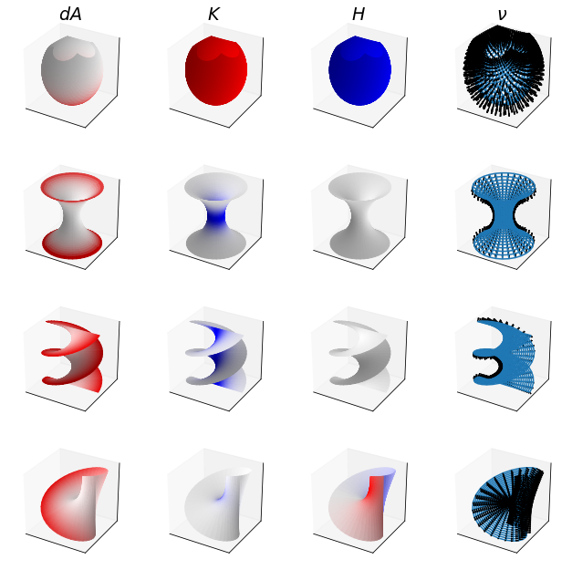

# Surf



This is a small library I wrote to visualize 2D manifolds in 3D space, along with associated quantities (like their curvature or the areas of their surface elements) -- partially because it's cool, and partially to check homework :)

For a visual demo, check out [the notebook](./demo.ipynb).

## Usage

First, define a function that maps from 2D space to 3D space. It should take in a vector of two components and return a vector of three components. It should also support having a batch dimension (which should be the final index). For example:

```python
def catenoid(x):
  U, V = x
  X = np.cosh(U)*np.cos(V)
  Y = np.cosh(U)*np.sin(V)
  return np.array([X,Y,U])
```

Then you can turn this into a `Surface` and compute interesting quantities:

```python
from surf import Surface

surface = Surface(catenoid)

inputs = np.array([[0,1,2,0,1,2],[0,0,0,1,1,1]]) # (U, V)

nu = surface.normal(inputs)
jac = surface.jacobian(inputs)
hes = surface.hessian(inputs)
gij = surface.metric_tensor(inputs)
hij = surface.shape_tensor(inputs)
K = surface.gauss_curvature(inputs)
H = surface.mean_curvature(inputs)

print(nu.shape) # (3, n)
print(jac.shape) # (3, 2, n)
print(hes.shape) # (3, 2, 2, n)
print(gij.shape) # (2, 2, n)
print(hij.shape) # (2, 2, n)
print(K.shape) # (n,)
print(H.shape) # (n,)
```

There are also helpers for plotting, which are demonstrated in the notebook. Gradients are computed using the wonderful [autograd](https://github.com/HIPS/autograd) library.

## License

[MIT](http://opensource.org/licenses/MIT)
